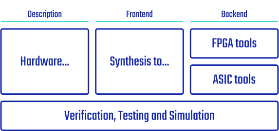
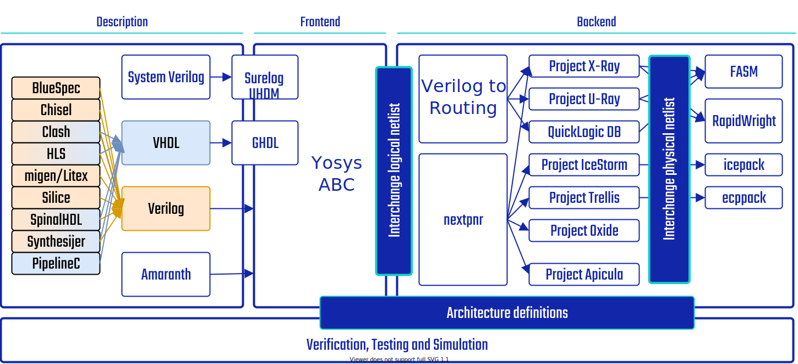

How it works
############

The F4PGA toolchain consists of logic synthesis and implementation tools, as well as chip documentation projects for
chips of various vendors.
To prepare a working bitstream for a particular FPGA chip, the toolchain goes through the following stages:

* First, a description of the FPGA chip is created with the information from the relevant bitstream documentation
  project.
  This part is done within the `F4PGA Architecture Definitions <https://github.com/chipsalliance/f4pga-arch-defs>`__.
  The project prepares information about the timings and resources available in the chip needed at the implementation
  stage, as well as techmaps for the synthesis tools.

* The second step is logic synthesis.
  It is carried out in the Yosys framework, which expresses the input Verilog file by means of the block and connection
  types available in the chosen chip.

* The next step is implementation.
  Placement and routing tools put individual blocks from the synthesis description in the specific chip locations and
  create paths between them.
  To do that, F4PGA uses either `nextpnr <https://github.com/YosysHQ/nextpnr>`__ or `Verilog to Routing <https://github.com/verilog-to-routing/vtr-verilog-to-routing>`__.

* Finally, the design properties are translated into a set of features available in the given FPGA chip.
  These features are saved in the `fasm format <https://github.com/chipsalliance/fasm>`__, which is developed as part of
  F4PGA.
  The fasm file is then translated to bitstream using the information from the bitstream documentation projects.

EDA Tooling Ecosystem
=====================

For both ASIC- and FPGA-oriented EDA tooling, there are three major areas that
the workflow needs to cover: hardware description, frontend and backend.

Hardware description languages are generally open, with both established HDLs
such as Verilog and VHDL and emerging software-inspired paradigms like
`Chisel <https://chisel.eecs.berkeley.edu/>`_,
`SpinalHDL <https://spinalhdl.github.io/SpinalDoc-RTD/>`_ or
`Migen <https://m-labs.hk/gateware/migen/>`_.
The major problem lies however in the front- and backend, where previously
there was no established standard, vendor-neutral tooling that would cover
all the necessary components for an end-to-end flow.

This pertains both to ASIC and FPGA workflows, although F4PGA focuses
on the latter (some parts of F4PGA will also be useful in the former).

Project structure
=================

To achieve F4PGA's goal of a complete FOSS FPGA toolchain, a number of tools and projects are necessary to provide all
the needed components of an end-to-end flow.
Thus, F4PGA serves as an umbrella project for several activities, the central of which pertains to the creation of
so-called FPGA "architecture definitions", i.e. documentation of how specific FPGAs work internally.
More information can be found in the :doc:`F4PGA Architecture Definitions <arch-defs:index>` project.

Those definitions and serve as input to backend tools like
`nextpnr <https://github.com/YosysHQ/nextpnr>`_ and
`Verilog to Routing <https://verilogtorouting.org/>`_, and frontend tools
like `Yosys <http://www.clifford.at/yosys/>`_. They are created within separate
collaborating projects targeting different FPGAs - :doc:`Project X-Ray
<prjxray:index>` for Xilinx 7-Series, `Project IceStorm
<http://www.clifford.at/icestorm/>`_ for Lattice iCE40 and :doc:`Project Trellis
<prjtrellis:index>` for Lattice ECP5 FPGAs.

