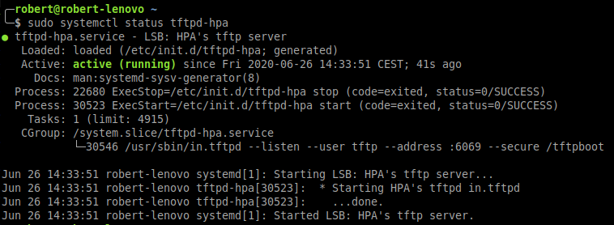

=========================
How to set up TFTP server
=========================

This document shows how to set up a TFTP server, needed by LiteX examples
available in the `SymbiFlow Examples`_ repository. The server will use
``/tftp`` directory.

.. _SymbiFlow Examples: <https://github.com/SymbiFlow/symbiflow-examples>`_

.. contents:: HOWTO steps
   :local:

1. Install the required system packages
---------------------------------------

.. tabs::

   .. group-tab:: Ubuntu

      .. code-block::

         sudo apt install tftpd-hpa

2. Configure the server
-----------------------

Open/Create the ``/etc/default/tftpd-hpa/`` file:

.. code-block::

   sudo nano /etc/default/tftpd-hpa

Set the following TFTP server configuration in the file:

.. code-block::

   # /etc/default/tftpd-hpa

   TFTP_USERNAME="tftp"
   TFTP_DIRECTORY="/tftp"
   TFTP_ADDRESS=":6069"
   TFTP_OPTIONS="--secure"

To save the file using ``nano`` editor use ``Ctrl+s``.
``Ctrl+x`` quits the editor

3. Create a directory for the server
------------------------------------

.. code-block::

   sudo mkdir /tftp
   sudo chmod -R 777 /tftp
   sudo chown -R tftp /tftp

4. Restart the TFTP server
--------------------------

.. code-block::

   sudo systemctl restart tftpd-hpa

5. Check if the server is working
---------------------------------

.. code-block::

   sudo systemctl status tftpd-hpa

6. Test the server
--------------------

- Create a `test.txt` file with arbitrary content:

   .. code-block::

      echo "TFTP server test" > /tftp/test.txt

- Enter the `/tmp` directory and connect to the TFTP server using the
  local network

   .. code-block::

      cd /tmp
      tftp 127.0.0.1 6069

- Use the server prompt to download the files.

   .. code-block::

      tftp> get test.txt
      Received 3728 bytes in 0.0 seconds

- To quit the prompt, use ``Ctrl+d``.
