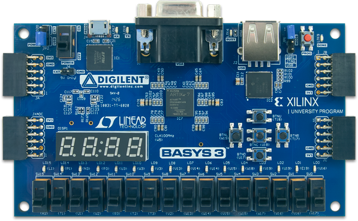
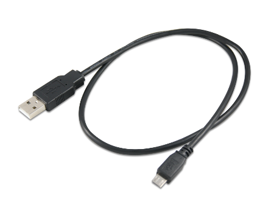
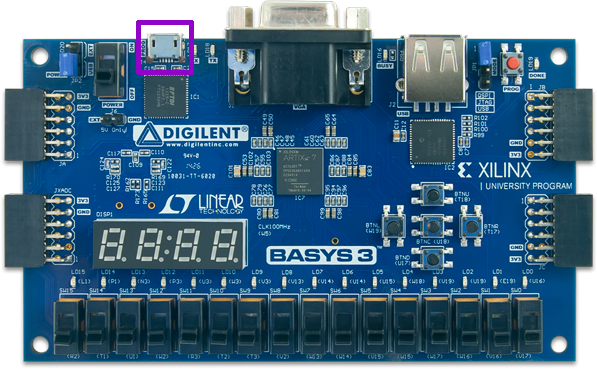

==================================
SymbiFlow Examples on Basys3 Board
==================================

.. _SymbiFlow Examples: https://github.com/SymbiFlow/symbiflow-examples
.. _Digilent Basys 3 Artix-7 FPGA Trainer Board: https://store.digilentinc.com/basys-3-artix-7-fpga-trainer-board-recommended-for-introductory-users

The purpose of this tutorial is to familiarize the user with the examples
showing how to use the SymbiFlow Toolchain in practice. The tutorial is designed
for a `Digilent Basys 3 Artix-7 FPGA Trainer Board`_ and uses the examples provided in
the `SymbiFlow Examples`_ repository.

.. contents:: Tutorial Steps
  :local:

1. Required Hardware
--------------------

To complete this tutorial, you need:

  - `Digilent Basys 3 Artix-7 FPGA Trainer Board`_
  - USB A to Micro-B cable

2. Download SymbiFlow Examples
------------------------------

All the examples used in this tutorial are located in the `SymbiFlow Examples`_
repository. Download them using:

.. code-block:: bash

   git clone https://github.com/SymbiFlow/symbiflow-examples

3. Install SymbiFlow Toolchain
------------------------------

Before generating the bitstream, you need to install the SymbiFlow Toolchain,
which contains all the necessary tools to synthesize and implement the example
designs. If you haven't installed the toolchain already, the following steps
will guide you through the entire process. More information about the
SymbiFlow Toolchain can be found in the dedicated
:doc:`documentation chapter <../toolchain-desc>`.

.. note::

   All the commands provided below should be used in the same terminal session.

#. Install the required system packages:

   .. tabs::

       .. group-tab:: Ubuntu

          .. code-block::

               sudo apt install git wget picocom

       .. group-tab:: Arch Linux

           .. code-block::

               pacman -Sy git wget picocom

#. Download and install the toolchain files:

   .. code-block:: bash

      INSTALL_DIR="/opt/symbiflow/xc7"
      bash conda_installer.sh -b -p $INSTALL_DIR/conda && rm conda_installer.sh
      source "$INSTALL_DIR/conda/etc/profile.d/conda.sh"
      conda env create -f symbiflow-examples/examples/xc7/environment.yml
      conda activate xc7
      wget -qO- https://storage.googleapis.com/symbiflow-arch-defs/artifacts/prod/foss-fpga-tools/symbiflow-arch-defs/continuous/install/4/20200416-002215/symbiflow-arch-defs-install-a321d9d9.tar.xz | tar -xJ -C $INSTALL_DIR

   .. note::

      The toolchain installation directory can be modified by changing
      the ``INSTALL_DIR`` environment variable.

#. Install the required packages from the ``symbiflow`` conda channel:

   .. code-block:: bash

      conda install -y -c symbiflow openocd

#. Close the conda environment:

   .. code-block:: bash

      conda deactivate

4. Activate the conda environment
---------------------------------

#. Add SymbiFlow Toolchain to the system ``$PATH`` variable:

   .. code-block:: bash

      export INSTALL_DIR="/opt/symbiflow/xc7"
      export PATH="$INSTALL_DIR/install/bin:$PATH"

#. Activate the conda environment:

   .. code-block:: bash

      source "$INSTALL_DIR/conda/etc/profile.d/conda.sh"
      conda activate

5. Connect the Basys3 Board
---------------------------

Connect the Basys3 Board to your computer using the USB cable:

6. Counter Example
------------------

The counter example is a simple design that implements the binary counter,
which displays its output on the board's LEDs. To generate and load the bitstream
with the design, follow the steps below:

#. Generate the counter example bitstream using the SymbiFlow Toolchain:

   .. code-block:: bash

      cd symbiflow-examples/examples/xc7/counter_test
      TARGET="basys" make

#. Load the bitstream to the board with OpenOCD:

   .. code-block:: bash

      openocd -f ${INSTALL_DIR}/conda/share/openocd/scripts/board/digilent_arty.cfg -c "init; pld load 0 build/top.bit; exit"

#. Check if the design is working correctly.

   - You should observe the following line in the OpenOCD output:

   .. code-block:: bash

      Info : JTAG tap: xc7.tap tap/device found: 0x0362d093 (mfg: 0x049 (Xilinx), part: 0x362d, ver: 0x0)

   - Additionally, the board's LEDs should show the sequentially ordered numbers
     displayed in the binary form:

   .. image:: ../images/counter-example-basys3.gif
      :align: center

7. PicoSoC Example
----------------------

#. Generate the picosoc example bitstream using the SymbiFlow Toolchain:

   .. code-block:: bash

      cd symbiflow-examples/examples/xc7/picosoc_demo
      make

#. Connect to the board using UART over the USB cable.

   Note that after plugging the board, two additional devices should appear
   in the ``/dev/`` directory. One of them is responsible for the communication
   with the board over UART.

   - To connect to the board, open a second terminal instance and type:

      .. code-block:: bash

         picocom -b 460800 /dev/ttyUSB1 --imap lfcrlf

   - If the picocom is unable to connect to the board, change the device path:

      If the picocom produces the following error:

      .. code-block:: bash

         FATAL: cannot open /dev/ttyUSB1: No such file or directory

      You might want to change the ``/dev/ttyUSB1`` to another device path.
      To list all the ``ttyUSBx`` devices, you can use:

      .. code-block:: bash

         ls -la /dev/ | grep ttyUSB

   .. note:: If the picocom is unable to connect to any ``ttyUSBx`` device,
      you probably don't have appropriate user permissions. On Debian distributions,
      type the command below to add the user to the ``dialout`` group.
      This should resolve the missing permissions problem:

      .. code-block:: bash

         sudo usermod -a -G dialout `whoami`

      You can also run the ``picocom`` program using ``sudo``

#. Load the bitstream to the board with OpenOCD:

   .. code-block:: bash

      openocd -f ${INSTALL_DIR}/conda/share/openocd/scripts/board/digilent_arty.cfg -c "init; pld load 0 build/top.bit; exit"

#. Check if the design is working correctly.

   - You should observe the following line in the OpenOCD output:

      .. code-block::

         Info : JTAG tap: xc7.tap tap/device found: 0x0362d093 (mfg: 0x049 (Xilinx), part: 0x362d, ver: 0x0)

   - The UART output should look as follows:

      .. code-block::

         Terminal ready
         Press ENTER to continue..
         Press ENTER to continue..
         Press ENTER to continue..
         Press ENTER to continue..

          ____  _          ____         ____
         |  _ \(_) ___ ___/ ___|  ___  / ___|
         | |_) | |/ __/ _ \___ \ / _ \| |
         |  __/| | (_| (_) |__) | (_) | |___
         |_|   |_|\___\___/____/ \___/ \____|

         [9] Run simplistic benchmark

         Command>

   - The board's LED should blink at a regular rate from left to the right

      .. image:: ../images/picosoc-example-basys3.gif
         :width: 49%
         :align: center

